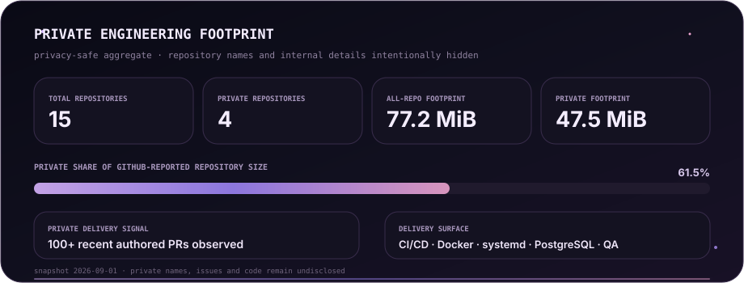
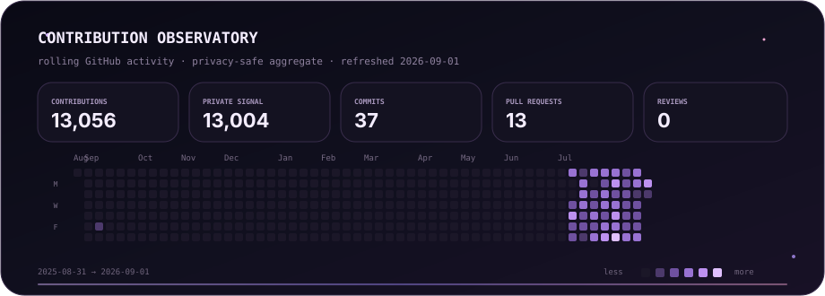

 

<h1>Stellmaria</h1>

☾ Java Backend Developer · systems · data · infrastructure · automation ☾

  

Backend developer drawn to clean boundaries, resilient services and production systems 
that remain understandable after the interesting part is over.

  

<code>code</code> · <code>dream</code> · <code>create</code>

 

 

 

 

 

 

