<div align="center">



<br />

# Stellmaria


<br />


<br /><br />

<sub>✦ a quiet little corner of GitHub ✦</sub>

</div>

<br />

<div align="center">

### ◇ github at a glance


<br />


</div>

<br />

<div align="center">

### ◇ activity after dark


</div>

<br />

<div align="center">

### ◇ tiny survival kit


<br /><br />

```text
while (night) {
    code();
    coffee++;
    pet(cat);
    fix("one last thing");
}
```

<sub>☾ commits are cheaper than sleep, apparently.</sub>

</div>
