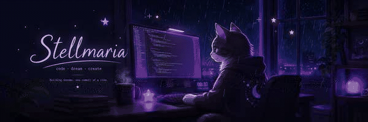

<h2>Stellmaria</h2>

☾ late-night code · cats · coffee · quiet commits ☾

  

<code>Java</code> · <code>Python</code> · <code>Git</code> · <code>GitHub</code> · <code>Docker</code> · <code>Linux</code>

  

<code>while (night) { code(); coffee++; pet(cat); fixOneMoreThing(); }</code>

  

✦ somewhere between a clean commit and one last tiny fix ✦

